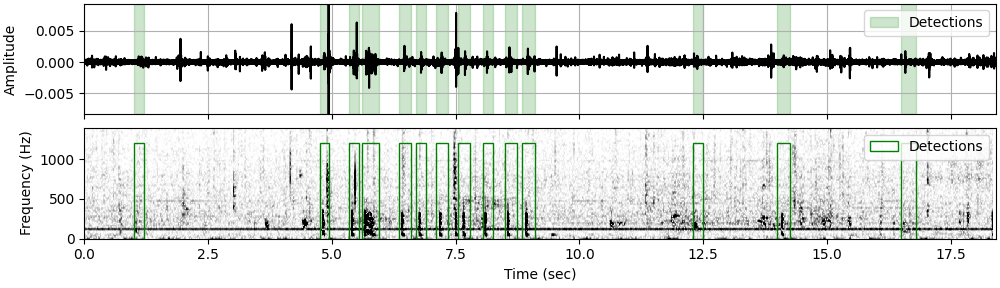

.. image:: docs/source/_static/fishsound_finder_logo_long_smaller.png

Welcome to FishSound Finder!
============================================

**FishSound Finder** is an open source python software to automatically detect and classify fish sounds in 
passive acoustic recordings. It is based on the python libraries `ecosound <https://ecosound.readthedocs.io/en/latest/>`_ and 
`ketos <https://docs.meridian.cs.dal.ca/ketos/>`_. FishSound Finder was trained to detect typical low frequency (< 1kHz) isolated grunts and knocks produced by fish.
Future versions will also include the capability to detect sounds from specific fish species (e.g. haddock). It was originally developed to analyze fish sounds found in coastal British Columbia (Canada) but proved to also work well in other parts of the world (e.g. Florida, USA).
Detection outputs from FishSound Finder are compatible with the popular bioacoustics software `Raven <https://ravensoundsoftware.com/>`_.

Documentation
-------------
The documentation of FishSound Finder can be found here: https://fishsound-finder.readthedocs.io. It includes a description of the software,
instructions on how to install and run it, as well as a tutorial.

Status
------
FishSound Finder has been tested on a number of different environments and is considered stable. We are keen to keep improving FishSound Finder and 
encourage users to get in touch with us to provide feedback and report issues/bugs.

Contributors
------------

Lead developper:

* `Xavier Mouy <https://xaviermouy.weebly.com/>`__

Collaborators:

* `Dana Haggarty <https://profils-profiles.science.gc.ca/en/profile/dana-haggarty-phd-msc>`__

* `Francis Juanes <https://juaneslab.weebly.com/>`__

* `Stephanie Archer <https://lumcon.edu/stephanie-archer/>`__

* `Philina English <https://ecophilina.wordpress.com/>`__

* `Sarah Dudas <https://sogdatacentre.ca/people/researchers/sarah-dudas/>`__

* `Darienne Lancaster <https://www.researchgate.net/scientific-contributions/Darienne-Lancaster-2163078290>`__

* `Bill Halliday <http://wdhalliday.weebly.com/>`__

Analysts :

* Aislyn Adams

* Cierra Hart

* Courtney Evans

* Emie Woodburn

* Erik Archer 

Credits
-------

* The FishSound Finder logo uses the rockfish image from `freepik.com <https://www.freepik.com/free-icon/rockfish-shape_718051.htm#page=1&query=rockfish%20shape&position=0>`_

* This project was initiated in the `Juanes Lab <https://juaneslab.weebly.com/>`_ at the University of Victoria (British Columbia, Canada) and received funding from `Fisheries and Oceans Canada - Pacific Region <https://www.dfo-mpo.gc.ca/contact/regions/pacific-pacifique-eng.html#Nanaimo-Lab>`_, the `Canadian Healthy Oceans Network <https://chone2.ca/>`_, and `NOAA Fisheries <https://www.fisheries.noaa.gov/new-england-mid-atlantic/endangered-species-conservation/passive-acoustic-research-atlantic-ocean>`__. `Ocean Networks Canada <https://www.oceannetworks.ca/>`__ provided data and computing resources.

License
-------
FishSound Finder is licensed under the open source `BSD-3-Clause License <https://choosealicense.com/licenses/bsd-3-clause/>`_.

