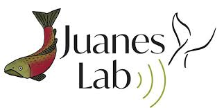
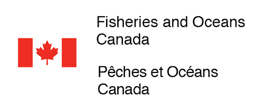

Credits
=======

- The FishSound Finder logo uses the rockfish image from `freepik.com <https://www.freepik.com/free-icon/rockfish-shape_718051.htm#page=1&query=rockfish%20shape&position=0>`_

- This project was initiated in the `Juanes Lab <https://juaneslab.weebly.com/>`_ at the University of Victoria (British Columbia, Canada) and received funding from `Fisheries and Oceans Canada - Pacific Region <https://www.dfo-mpo.gc.ca/contact/regions/pacific-pacifique-eng.html#Nanaimo-Lab>`_, the `Canadian Healthy Oceans Network <https://chone2.ca/>`_,and `NOAA Fisheries <https://www.fisheries.noaa.gov/new-england-mid-atlantic/endangered-species-conservation/passive-acoustic-research-atlantic-ocean>`__. `Ocean Networks Canada <https://www.oceannetworks.ca/>`__ provided data and computing resources.

.. image:: _static/NOAA_FISHERIES_logoH.png
   :scale: 25 %

