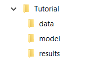
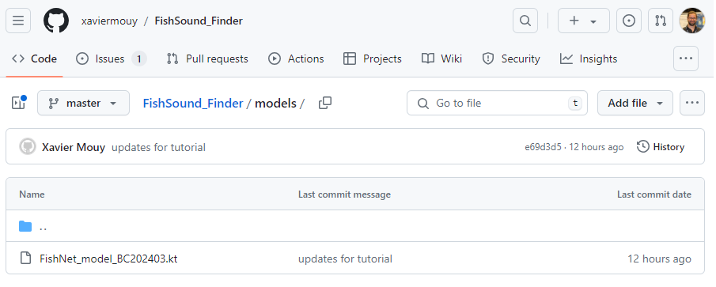

.. _tutorial:

Tutorial
========

This tutorial goes through all the steps required to set up a project, run FishSound Finder and visualize the detections results in Raven.

Setting up the project structure
--------------------------------

* Create a new folder for your project called *Tutorial*
* In the *Tutorial* folder, create with three new subfolders called *model*, *data*, and *results*.

The project folder should look like this:

Downloading the model file
--------------------------------------------

In this example we will run the generic fish sound detector. The classification model is located on 
FishSound Finder's GitHub page under the `models <https://github.com/xaviermouy/FishSound_Finder/tree/master/models>`_ directory.

 
* Download the classification model `FishNet_model_BC202403.kt <https://github.com/xaviermouy/FishSound_Finder/raw/master/models/FishNet_model_BC202403.kt>`_ from GitHub.
* Place the .kt file in your *model* folder.

Downloading audio data
----------------------

For this tutorial we will use a single wav file located in the *data* directory of `FishSound Finder's GitHub page <https://github.com/xaviermouy/FishSound_Finder/tree/master/data>`_. 
This audio file was collected off Vancouver Island by an AMAR recorder set with a sampling rate of 32 kHz. The original file was 30-minute long, but
was trimmed down for this tutorial. Note that FishSound Finder can interpret timestamp information from the name of the audio files.
It currently supports timestamp formats from most popular acoustic recorders including SoundTrap and AMAR. 

* Download the audio file `AMAR173.4.20190920T004248Z.wav <https://github.com/xaviermouy/FishSound_Finder/raw/master/data/AMAR173.4.20190920T004248Z.wav>`_ from GitHub.
* Place it in your *data* folder.

Creating a deployment file
--------------------------

Creating a deployment file is not necessary but highly recommended. It allows FishSound Finder to embed metadata into the detection results, which
makes the post-processing of detection results from multiple recorders much easier. Notice that metadata are included in the NetCDF files generated by FishSound Finder, but
not in the Raven files.

* Download a deployment file template `deployment_info.csv <https://github.com/xaviermouy/FishSound_Finder/blob/master/data/deployment_info.csv>`_ from GitHub.
* Place it in your *data* folder.
* Open the deployment_info.csv file with a text editor (e.g. NotePad++) and edit the fields as necessary.

	* **audio_channel_number**: *[Integer (starting at 1)]* Audio channel to being processed.
	* **UTC_offset**: *[Integer]* GMT hour offset of the timestamps in the audio filenames.
	* **sampling_frequency**: *[Float]* Sampling frequency of the audio files in Hz.
	* **bit_depth**: *[Integer]* Bit depth of the audio files.
	* **mooring_platform_name**: *[String]* Short name describing the mooring design (e.g. volumetric array, bottom-mounted).
	* **recorder_type**: *[String]* Name of the acoustic recorder (e.g. SoundTrap 300, AMAR G3).
	* **recorder_SN**: *[String]* Serial number of the acoustic recorder.
	* **hydrophone_model**: *[String]* Model of the hydrophone (e.g. HTI-96).
	* **hydrophone_SN**: *[String]* Serial number of the hydrophone.
	* **hydrophone_depth**: *[Float > 0]* Depth at which the hydrophone was located in meters.
	* **location_name**: *[string]* Name of the deployment locations.
	* **location_lat**: *[Float]* Latitude of the deployment location in decimal degrees.
	* **location_lon**: *[Float]* Longitude of the deployment location in decimal degrees.
	* **location_water_depth**: *[Float > 0]* Water depth at the deployment location in meters.
	* **deployment_ID**: *[String]* Unique name identifying this particular deployment (e.g. SI-RCAIn-20190410).
	* **deployment_date**: *[String]* Date of deployment. Date format: YYYYMMDDTHHMMSS (e.g. 20190410T150155).
	* **recovery_date**: *[String]* Date of recovery. Date format: YYYYMMDDTHHMMSS (e.g. 20190410T150155).

  Example of deployment_info file:

  .. csv-table:: deployment_info.csv
     :header: "audio_channel_number", "UTC_offset","sampling_frequency","bit_depth","mooring_platform_name","recorder_type","recorder_SN","hydrophone_model","hydrophone_SN","hydrophone_depth","location_name","location_lat","location_lon","location_water_depth","deployment_ID","deployment_date","recovery_date"
   
     1,-8,96000,24,bottom weight,SoundTrap 300,1342218252,SoundTrap 300,1342218252,13.4,Snake Island RCA-In,49.21166667,-123.88405,13.4,SI-RCAIn-20190410,20190410T150155,20190625T051114
 

Running FishSound Finder
------------------------

Now all the data and configuration files are set up and we can run FishSound Finder. It is here assumed that you are using Anaconda on a Windows machine.

* Open Anaconda Navigator
* Under the *Environments* tab on the left, select the python environment in which you installed FishSound Finder (see :ref:'Installation<Installing FishSound Finder>'Installation section),
  and start a Terminal. 
  
  .. image:: _static/open_terminal.png
     :scale: 70 %
  
* Change the current directory to *Tutorial*. 

  .. code-block:: console
  
     $ cd C:\Users\xavier.mouy\Desktop\Tutorial

* Start FishSound Finder to process the audio files that are in the *data* folder. 

  .. code-block:: console
       
	 $ fishsound_finder --audio_folder=".\data"  --output_folder=".\results" --model_file=".\models\FishNet_model_BC202403.kt" --threshold=0.995 --deployment_file=".\data\deployment_info.csv" 

* **Alternative**: If you don't want to type the input arguments every time, you can also create a text file with all the input arguments (one per line)
  and run FishSound Finder using the @ command pointing to that text file. 
  
  *args_file.txt* (saved in the *Tutorial* folder):
  
  
  .. code-block:: console
  
     --audio_folder=".\data"
     --output_folder=".\results" 
     --model_file=".\models\FishNet_model_BC202403.kt" 
     --threshold=0.996 
     --deployment_file=".\data\deployment_info.csv" 
  
  Now running FishSound Finder using *args_file.txt*.
    
  .. code-block:: console
  
     $ fishsound_finder @.\results\args_file.txt

* The console should now display the files being processed and the processing steps in progress.

  .. code-block:: console
  
     Namespace(audio_folder='.\data', output_folder='.\results', model='.\model\\FishNet_model_BC202403.kt', threshold=0.996, channel=1, extension='.wav', batch_size=512, step_sec=0.05, smooth_sec=0, min_dur_sec=None, max_dur_sec=None, class_id=1, tmp_dir=None, deployment_file=".\data\deployment_info.csv", deployment_id=None, recursive=False)
	 
     1/1: .\data\AMAR173.4.20190920T004248Z.wav
     571 detections
     Executed in 58.9825 seconds
     All files processed in 58.9825 seconds

* Once FishSound Finder has finished running, all the detection results are written in the *results* folder. In this case,
  it created the default netCDF4 file (*AMAR173.4.20190920T004248Z.wav.nc*) and a Raven file (*AMAR173.4.20190920T004248Z.wav.chan1.Table.1.selections.txt*), and a SQLite file (*detections_20240326231319.sqlite*). 
  The SQLite file is a SQL database that regroups the detection results from all files that have been processed. It can be opened using with a software like SQLiteStudio.
  
  .. image:: _static/results.png
     :scale: 70 %
   
  Here we only used a single audio file, but note that FishSound Finder will process all audio files located in the data folder. Also note that if the processing is interupted, you can rerun FishSOund Finder uisng the same arguments and it will start the processing where it left off (i.e. without reprocessing the files already analized).
   

Reviewing the processing logs
------------------------------

It is important to review the processing logs once FishSound Finder has finished running to ensure there was no errors.
Two log files are automatically created in the *results* folder:

* **errors_log.txt**: Lists all errors that occurred. An empty file indicates no errors occurred.
* **full_log.txt**: Lists all the information displayed during the processing (including processing times and warning messages).

Analyzing the detection results (documentation in progress)
-------------------------------

Detection results from FishSound Finder can be analyzed using the bioacoustics software Raven or
libraries such as the ecosound. With the example of the generic fish detector all detections are 
saved in the output files and are labelled as **FS** (for a Fish Sound). Each detections has
a classification confidence value (comprised between 0 and 1) which can be used to make the detector more or less sensitive
depending on the application.

With Raven
**********

To visualize the detection results in Raven:

* Open the audio file in Raven
* In the **File** menu, select "**Open Sound Selection Table...**", then select the file *AMAR173.4.20190920T004248Z.wav.chan1.Table.1.selections.txt*
  from the *results* folder.
* Detection boxes should automatically appear. Notice the confidence value in the selection table. 

With ecosound 
*************

Here are some code snippets that can be used to analyze the detection results with ecosound. While ecosound can import
data from Raven, it is typically better to import the netCDF4 file, as it contains all the metadata
for each detections.

Example 1: Display a summary of the detections
______________________________________________
   
   .. code-block:: python
   
      from ecosound.core.measurement import Measurement
      detection_file = r".\results\AMAR173.4.20190920T004248Z.wav.nc"
      detec = Measurement()
      detec.from_netcdf(detection_file)
      detec.summary()
   
   