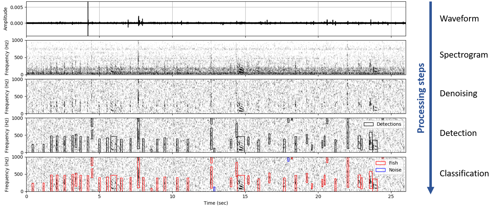

FishSound Finder
================

Why FishSound Finder?
---------------------

Some fish produce sounds to find mates, defend their territory, or keep cohesion within their group.
Scientists can use these sounds to detect the presence, the diversity, and potentially the number of fish in an environment,
over large areas and long time periods. However, manually going through passive acoustic recordings to find fish sounds is a long, costly,
and tedious process that limits the usefulness of passive acoustics for monitoring fish. The objective of FishSound Finder is to make
that process easier and more efficient by automatically finding fish sounds in acoustic recordings. Of course, automatic
detectors are not perfect and still require some degree of manual analysis. However, this approach makes the analysis of large datasets
more feasible. Some fish sound detectors have been developed by the scientific community over the years, however they are not often made
open-source, which limits their usability. By making FishSound Finder open-source, we hope that ecologists that are not so
familiar with acoustics will be able to integrate more easily passive acoustics in their own study. It is also our hope that more people
can contribute to the source code to improve the performance and add new functionalities to FishSound Finder.  

What can I use it for?
----------------------
FishSound Finder can be used for many different things. If you are working on fish sounds in a laboratory setting (i.e., tanks), it can make the
annotation of fish sounds more efficient. If you are working in the natural setting (e.g. lakes, rivers, ocean), it can be used to study fish sound
repertoire, fish occurrence, or biodiversity over several month of data and over several locations. Such large scale studies are just not feasible without the use of 
automatic detectors. Examples of large scale studies using fish sounds include monitoring of sensitive habitats for marine conservation 
(e.g. glass sponge reefs off British Columbia, `Archer et al., 2018 <http://www.int-res.com/abstracts/meps/v595/p245-252/>`_) or detection of spawning events for fisheries management 
(e.g. haddock in the Gulf of Maine, `Rountree et al., 2020 <https://asa.scitation.org/doi/pdf/10.1121/2.0001257>`_).

Does it work in all environments?
---------------------------------
Unfortunately, no. Fish produce different types of sounds in different part of the world, and underwater noise conditions are not the same everywhere. 
This all influences what type of signal the detector will target and how well it will perform. Currently, FishSound Finder has been developed for
detecting fish grunts and knocks off the coast of British Columbia. It could still potentially be used in other parts of the world that have similar fish species
and noise conditions like for example the West coast of the United States. It is anticipated that in the future, FishSound Finder will have the option to
detect species-specific sounds in other parts of the world. Most likely candidates are haddock sounds in the Northwest Atlantic 
(`Mouy et al. 2018 <https://asa.scitation.org/doi/10.1121/1.5036179>`_), and lingcod sounds off British Columbia 
(`Mouy et al., 2019 <https://asa.scitation.org/doi/10.1121/1.5136904>`_). 

How does it work?
-----------------

FishSound Finder uses signal processing and machine learning techniques. For detecting fish sounds off the coast of British Columbia, the process is as follow.
 
1. The spectrogram of the sound recording is computed. 
2. A median filter is applied to each row (frequency band) of the spectrogram to remove tonal sounds and increase the signal-to-noise ratio of acoustic transients.
3. A blob detector based on a local measure of variance is used to define the time and frequency boundaries of acoustic transients in the spectrogram.
4. A set of features representing the distribution of the energy in time and frequency for each transient is calculated. 
5. A Random classifier uses these features to define if the transient is a fish sound or noise. The random forest model was trained using ~50,000 manually annotated
   fish and noise sounds collected  over several years and at different locations around Vancouver Island, BC.

A peer-reviewed scientific publication fully describing the approach and performance results is in the works and will be published in the near future.

Who can use it?
--------------------
Anyone interested in studying the underwater sounds and marine ecology can use FishSound Finder. No programming knowledge are required to run it. Reading the
:ref:`example section<examples>` of this documentation should be enough to get you started. FishSound Finder is also compatible with standard bioacoustic analysis tools such as
Raven (Cornell University) and Pamlab (JASCO Applied Sciences). More advanced users/developers can also look at the source code to better understand it and modify
it as they need. 

Requirements
------------
FishSound Finder requires to have Python 3.7 installed on your machine(s). It is based on the high-level python library 
`ecosound <https://ecosound.readthedocs.io/en/latest/>`_, which itself is built on top of lower-level python libraries such as Numpy, scikits-learn, dask,
pandas and Xarray.

Contributors
------------

`Xavier Mouy <https://xaviermouy.weebly.com/>`_ (@XavierMouy) leads this project as part of his PhD in the `Juanes Lab <https://juaneslab.weebly.com/>`_ 
at the University of Victoria (British Columbia, Canada). `Stephanie Archer <https://lumcon.edu/stephanie-archer/>`_ (@ArcherEcology), 
`Philina English <https://ecophilina.wordpress.com/>`_ (@ecophilina), Emie Woodburn, and Courtney Evans have provided manually annotated 
fish sounds for training and testing the machine learning models for British Columbia.

